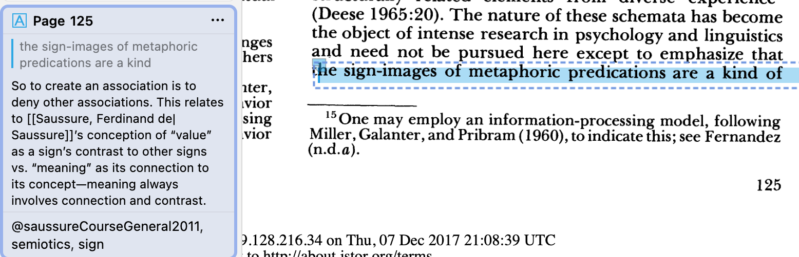
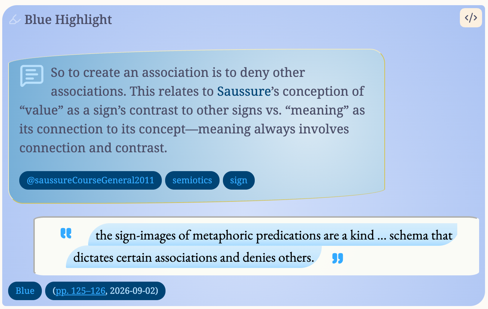

# Literature Notes

ScholarWeft treats each source's literature note (normally `@citekey.md`) as the graph node its citations link to. This page covers where those notes live, how they are created and formatted, and how ScholarWeft refreshes them.

## Folder

**Settings → Literature note import → Literature notes folder** sits directly under the **Import literature notes with ScholarWeft** toggle and sets where ScholarWeft creates and finds its literature notes (default `Literature Notes`; leave it blank for the vault root).

The field follows the import path, so there is only ever one answer to "where do my notes go":

- **Import literature notes with ScholarWeft** (the default) — this field decides.
- **ZotLit** — notes go to the folder configured in ZotLit's own settings (read live), so ZotLit's notes and ScholarWeft's stay in one place. To change it, use ZotLit's settings.

Using a dedicated folder keeps citations resolvable and tidy, but any folder works as long as the filename is `@citekey`.

## Finding a note

ScholarWeft identifies a literature note by its stable **`zotero-key`** first — the Zotero item key (`KEY`, or `KEYgGROUPID` for a group library) — and only if that’s missing by the `@citekey` filename. Even if you rename a note or change its citekey in Zotero, ScholarWeft can still find it and update it by its item key rather than creating a duplicate.

If a file already sits at the expected `@citekey.md` name but is *not* that item's note (a different library's copy, another work with a similar title, or one of your own notes), ScholarWeft never overwrites it: it creates a suffixed sibling (`@citekeya.md`, `@citekeyb.md`, …) and tells you. If that happens, you should give that other note a different name and rename the literature note as `@citekey.md` if you want to cite it.

## Creating notes

- **Create literature notes for citations lacking notes (current note)** and **…(vault)** create a note for every cited work that doesn't already have one.
- Individual notes can also be created from the reference sidebar, a citation tooltip, or an entry's "Create literature note" button.

Creating notes needs **Zotero** for citekey and metadata lookup. ZotLit is not required.

**Consistent citekeys.** For short, stable citekeys with no punctuation, install the **Better BibTeX** add-on in Zotero and set its **Citation key formula** (Zotero → Settings → Better BibTeX) to:

```
auth(15).lower.alphanum.nopunct + shorttitle(2,2).nopunct.alphanum + year.alphanum.nopunct
```

This gives every item `firstauthor + two-letter short title + year` (e.g. `smithSo2020`). See [Setup, Step 3](./setup.md#3-better-bibtex-recommended).

## Note template

**Settings → Literature note import → Import literature notes with ScholarWeft** is on by default: notes are rendered with ScholarWeft's bundled template, and no other plugin or template is needed. (Turn it off only if you would rather let ZotLit create your notes, and install ScholarWeft’s ZotLit templates for notes that look similar to what you get with ScholarWeft’s import.)

ScholarWeft’s literature import process uses the Eta Javascript templating language. Although you can still control the intricate details of your literature note output as you can with other Zotero import plugins, ScholarWeft provides some helper functions that handle the details of YAML and markdown syntax so you can set the layout and look of your notes without worrying about syntax errors glitches.

### The default template and where it lives

ScholarWeft ships one self-contained template that emits **both** the frontmatter and the body. With **Use the default template** on (the default), notes render with it and you never need to open a file.

To inspect it, the bundled copy is extracted into the plugin folder:

```
.obsidian/plugins/scholar-weft/sw-note-templates/sw-note.eta.md
```

The plugin writes it there on load (bundled inside `main.js`, extracted automatically), so you can open it any time to see exactly what the default note does. That folder is **plugin-managed output, not a place to hand-edit**: ScholarWeft rewrites the file whenever the bundled copy changes (a plugin update), so an edit made there is eventually overwritten. To customise, make a copy in your vault — the next section does that for you.

### Using your own template

1. **Settings → Literature note import → Copy the default template to your vault.** Pick a folder (for example `Templates/`). ScholarWeft writes an editable copy there, selects it as your template, and turns **Use the default template** off. It never overwrites an existing file — a taken name gets a numeric suffix (`sw-note-2.eta.md`, …).
2. Open the copy and edit the frontmatter and body, or add sections of your own. Keep the `%%sw-managed%%` … `%%/sw-managed%%` markers around the generated annotations region (see **Re-importing** below) if you want it to keep updating.
3. **Settings → Literature note import → Template file** shows the path once **Use the default template** is off. Type or paste a vault-relative path, or use **Browse…** to pick any Markdown file (`.eta.md` files included) in your vault. Turn **Use the default template** back on to return to the bundled template.

Your copy is an ordinary vault file, so plugin updates never touch it. If the file is moved, renamed, or emptied, ScholarWeft falls back to the bundled template until you fix the path.

> **Iterating safely:** the Zotero data explorer (below) previews with whichever template is selected, so you can check a change before importing anything. To see it on a real note, run **Update this literature note** on a note you don't mind re-rendering.

### Previewing your output: the Zotero data explorer

**Command palette → ScholarWeft: Open Zotero data explorer** opens a sidebar that lists your loaded Zotero library and previews an item through the **real render pipeline** — the preview is exactly what ScholarWeft would write. This is the fastest way to iterate on a template.

The sidebar has two tabs:

- **Preview** — the rendered note output, using the selected template.
- **Data** — the full `item` JSON the template renders against (see [The template data model](#the-template-data-model)). Useful for checking a field name or value before using it in a template.

### Template syntax basics

Templates are Eta files (`.eta.md`). The delimiters you need:

| Syntax | Meaning |
|---|---|
| `<% … %>` | Run a statement (assignments, `if`, `for`, helper calls that return nothing) |
| `<%= … %>` | Output the value (the engine coerces it to text) |
| `<%~ … %>` | Output the value with no filter — how the default template emits helper output |
| `<%# … #%>` | Comment |

The default template uses `<%~ … %>` for helper output, because helpers like `add_property()` and `annotation_callout()` return finished Markdown that needs no further processing. For a plain field, `<%= item.title %>` works too; when inserting a raw field into the **body**, wrap it with `escape_md(item.title)` so any `[` or `<` in the value can't be read as Markdown.

**Beware whitespace:** the default template ends nearly every line with `-%>` to trim the newline. This matters because a stray blank line inside frontmatter or a callout breaks Obsidian. The helpers exist so you rarely have to worry about this, but if you write raw YAML or hand-built callouts, keep the trimming.

### What each part of the default template does

| Template section | What it produces |
|---|---|
| `start_YAML()` … `end_YAML()` | The whole `---` frontmatter block, serialised by `add_property()` |
| `add_property('document-type', '[[zotero-import]]')` … | One line per property (see the model below) |
| `## Notes` (outside the markers) | Your section; child notes are inlined here by `zotero_notes()` |
| `%%sw-managed%%` … `%%/sw-managed%%` | The managed `## Annotations` region — replaced on re-import |

### Helper functions

These are available as bare globals (no import needed). All are called inside `<% %>` / `<%~ %>`. Note that `add_property()` and friends act on the **current render**, so they must appear between `start_YAML()` and `end_YAML()`.

#### YAML frontmatter

| Helper | What it does |
|---|---|
| `start_YAML()` | Begin the frontmatter block. Must be called once, before any `add_property`. |
| `add_property(key, value, opts?)` | Add one property. `value` may be a string, number, boolean, an array of those, or `null`/`undefined`. |
| `add_raw_yaml(text)` | Insert the given lines verbatim — the escape hatch for YAML the serialiser can't express. |
| `end_YAML()` | Close and serialise the block; returns the complete `--- … ---` text. |

`add_property()` is where the "never worry about YAML" promise lives. It decides quoting, indentation, block scalars (`|-`), list formatting, and which empty values to omit, following Obsidian's own Properties writer:

- **Multi-line** strings become a `|-` block scalar with two-space indentation and no quoting.
- **Single-line** strings are quoted only when YAML would otherwise misread them (`: ` or ` #`, a leading `[[`, a value that looks numeric/boolean/null, an empty value, etc.).
- **Empty / `null` / `undefined`** values are omitted entirely *unless* `opts.force` is set.
- An empty array writes `key: []` only with `opts.force`.

**`opts`** (all optional):

| Option | Values | Meaning |
|---|---|---|
| `force` | `true` | Write the property even when it is empty (`""` / `[]`). |
| `merge` | `replace` (default), `append`, `keep`, `subtract` | What a **re-import** does with this property. `replace` = the fresh value wins (an empty value removes the property); `append` = union, keeping items already on disk; `keep` = write once, then never again; `subtract` = a one-time migration (drop items a *different* property now owns). |
| `subtractFrom` | a property key | With `merge: 'subtract'`, the property that now owns the list (used for the one-time `related` → `sw-related` transfer). |
| `quote` | `auto` (default), `always`, `never` | Force or suppress quoting for single-line scalars. Block scalars are never quoted. |

`merge` is how the shipped template keeps `related:` as *yours* while rebuilding `sw-related:` from Zotero on every import — see the `related` / `sw-related` note below.

#### Filename

| Helper | What it does |
|---|---|
| `set_file_name(name)` | Sets the note's filename (without `.md`). Default is `@<citekey>`. Placing it in the template keeps every setting in one copy-pasteable file. |

When you change the filename, the next **Update this literature note** (or import) renames the file; the stable `zotero-key` is what lets ScholarWeft keep finding the same note afterwards.

#### Creators

| Helper | What it does |
|---|---|
| `creators_by_type(format?, opts?)` | Returns one group per Zotero `creatorType`, as `[{ key: 'authors', values: ['[[Smith, Jane]]', …] }, …]`. It does **not** write YAML — you loop over it and call `add_property` yourself. |
| `creator_values(role, format?, opts?)` | The formatted names for **one** role, for a fixed property (e.g. `add_property('editors', creator_values('editor'))`). |
| `creator_names(role?, format?, opts?)` | A formatted, comma-joined **string** for body use (e.g. an introduction line). |

**Format tokens** (used by all three): `{family}`, `{given}`, `{literal}`, `{role}`, `{fullName}`. The default is `{family}, {given}` for personal names and `{literal}` for institutional ones; an empty token leaves no dangling comma.

**`opts`:**

| Option | Applies to | Meaning |
|---|---|---|
| `link` | `creators_by_type`, `creator_names` | Wrap each name in `[[…]]`. Default `true` for `creators_by_type` (frontmatter), `false` for `creator_names`. |
| `roles` | `creators_by_type`, `creator_names` | Restrict/order which Zotero roles appear. |
| `suffix` | `creators_by_type` | Property-name suffix; default `s` so `author` → `authors`. |
| `format` | all | The token template (also accepted as the `format` argument). |
| `join` | `creator_names` | Separator; default `, `. |

To add a Zotero role the default template doesn't list, add one line next to the others:

```eta
<% add_property('directors', creator_values('director')); -%>
```

#### Child notes

| Helper | What it does |
|---|---|
| `zotero_notes({ mode?, level? })` | The item's Zotero child notes as body Markdown. `mode: 'inline'` (default) writes each note's text; `mode: 'link'` links an imported note file instead. `level` is the heading level the note's own top heading is shifted to, and the level a short first line (Zotero's note title) is promoted to (default 3 — one below `## Notes`). Multiple notes are joined with `---`. |

The **Child-note heading level** setting supplies the default `level`, so a template doesn't have to hard-code it.

#### Callouts and annotations

| Helper | What it does |
|---|---|
| `annotation_callout(annotation, opts?)` | Reproduces the standard annotation callout — colour/type header, nested comment, highlight/image/ink body, tags, and the colour/page/date footer — in one call. |
| `merge_annotations(annotations)` | Applies the `+`-continuation rule to a list of annotations. The import path already applies it to `item.annotations`, so you only need this if you assemble your own list. |
| `callout({ type, title?, body?, collapse? })` | The generic escape hatch for a hand-built callout. `body` may be multi-line, and `collapse: true` renders it collapsible. |

`annotation_callout` `opts`: `tags` (include the annotation's tags as `[[tag]]` lines, default `true`) and `footer` (include the colour/page/date footer, default `true`).

#### Value utilities

| Helper | What it does |
|---|---|
| `wikilink(target, alias?)` | `[[target]]` or `[[target|alias]]`; empty string for an empty target. |
| `link_note(alias?, subpath?)` | A link to **this** literature note (uses the note's path once known). |
| `md_html(html)` | Convert a Zotero HTML field to Markdown (entities resolved to Unicode). |
| `heading(level, text)` | A heading with the level clamped to 1–6. |
| `escape_md(text)` | Escape `[` and `<` in field text before inserting it into the **body**. Frontmatter is never markdown-escaped. |
| `import_date()` | Today's date (`YYYY-MM-DD`). |
| `is_first_import()` | `true` on a first import, `false` when re-importing an existing note. |
| `short_title()` | The item's short title, else the title up to its first `:`. |
| `aliases()` | The default `aliases:` list (`Author - year - Short Title`, then the full title, then the short title). |
| `related_links()` | Zotero's tags and Related items as `[[…]]` links (for `sw-related:`). |
| `collection_links()` | The item's Zotero collections as `[[…]]` links (for `zotero-collections:`). |
| `attachment_links()` | Attachments as `[filename](zotero link)` entries. |
| `attachments_with_annotations()` | The attachments that actually carry annotations, in fetch order. |
| `merge_into(existing, rendered)` | Reconciles a fresh render with an existing note (managed fields + managed region). `renderNote` already calls this; you rarely call it yourself. |

### The template data model

Every helper reads from a single data root, **`item`**. It mirrors ZotLit's published `zt` contract v2, so a template written here is close to one written for either plugin. The most useful fields:

| Field | Type / notes |
|---|---|
| `item.title`, `item.shortTitle`, `item.abstract` | HTML in Zotero, already converted to Markdown. Not escaped (frontmatter may legitimately hold `[[links]]`); wrap with `escape_md()` for the body. |
| `item.itemType` | Zotero item type (`journalArticle`, `book`, …). |
| `item.citekey`, `item.citationKey` | The Better BibTeX citekey. |
| `item.key` / `item.indexedKey` | Zotero item key (`EKUBHHNW`) / its library-scoped form (`KEYgGROUPID` for a group library). |
| `item.date` | A date object: `.year`, `.month`, `.day`, `.value`, `.kind`; `String(item.date)` also renders something. |
| `item.dateAdded`, `item.dateModified` | ISO timestamps. |
| `item.DOI`, `item.url`, `item.ISBN`, `item.ISSN` | Strings or `null`. |
| `item.containerTitle` | The containing work (journal, book title, …). |
| `item.volume`, `item.issue`, `item.pages`, `item.edition` | Strings or `null`. |
| `item.publisher`, `item.place` | Strings or `null`. |
| `item.series`, `item.seriesNumber`, `item.numberOfVolumes` | Strings or `null`. |
| `item.creators` | Ordered list of `{ family, given, literal, role, fullName }`. `role` is Zotero's `creatorType`. |
| `item.authors` | The primary creators (authors, directors, …). |
| `item.authorsShort` | `"Smith"`, `"Smith and Jones"`, `"Smith et al."` |
| `item.tags` | `[{ name, type }]` (type is `"unknown"` on this path). |
| `item.collections` | The Zotero collections the item belongs to, `[{ key, name, path }]` (`path` is the ancestor chain, e.g. `['Economics','Microeconomics']`). |
| `item.number`, `item.genre`, `item.authority`, `item.jurisdiction`, `item.medium`, `item.section`, `item.eventTitle`, `item.eventPlace`, `item.archive`, `item.archiveLocation`, `item.callNumber`, `item.version`, `item.status` | Type-specific fields (see **Every item type contributes its own fields** below). |
| `item.relatedItems` | `[{ key, citationKey, title }]` for Zotero's Related panel. |
| `item.attachments` | `[{ key, filename, contentType, backlink, fileLink, … }]`. |
| `item.annotations` | `[{ type, text, comment, colorName, pageLabel, page, backlink, imgLink, tags, parentAttachment, continuationMedia, … }]`. |
| `item.notes` | `[{ key, title, text, html, noteLink }]`. |
| `item.backlink` | The `zotero://select/…` deep link. |
| `item.extra` | Parsed `extra` field; recognised keys (e.g. `Original Date:`) also appear as properties (`item.originalDate`). |

Several fields carry **callable link helpers** (e.g. `item.noteLink(alias?, subpath?)`, `item.attachments[].fileLink()`, `item.annotations[].imgLink(alias?)`) rather than plain strings, because they may be unresolved until the note path is known. Call them.

Fields the cache cannot supply faithfully are noted where they matter: `tags[].type` is `"unknown"` (Zotero's tag types are not retained), `relatedItems` and `collections` need the Zotero database (collection names are resolved from the collection index, so they are `[]` until it loads), and cross-role creator ordering may differ from Zotero's own.

### Example output

Here’s an example of the default template’s output:





A few things to note in this example:

- The highlighted quote spans two pages, and the second comment (not visible here because it's in a different column) starts with `+`, so it’s appended to the previous quote, and the location information below is a page range including both pages.
- Wikilinks in the Zotero annotation comment — `[[Saussure, Ferdinand de|Saussure]]` — are rendered as links in Obsidian.
- “Tags” added to the Zotero comment are also rendered as `[[wikilinks]]`, including a `@citekey` reference. (Obsidian doesn’t allow rendering citations inside callouts, so it’s presented as a literal citekey.)

The template structures each literature note as follows:

- **Frontmatter** includes metadata provided by Zotero such as document-type, created, added, up, item-type, title, shorttitle, authors, editors, abstract, …), converting any HTML formatting in `abstract` and `title` to Markdown. Fields that do not apply to an item are left out entirely.
- **Every item type contributes its own fields.** Not every Zotero item has a title — a case has a **case name**, a statute a **name of act**, an email a **subject** — and those stand in for the title. The fields that make a reference readable are imported as well: `number` (docket, report, patent, public-law number…), `authority` (court or issuing body), `genre` (thesis, report, manuscript type…), `jurisdiction`, `medium`, `section`, `event`, `pages`, and so on. So a case note carries its court, docket number, reporter and page rather than just a name.
- **Collections are recorded** in `zotero-collections:` as `[[…]]` links to the collections the item belongs to (via `collection_links()`). Zotero owns this list, so it is rebuilt on every update — moving an item out of a collection removes the link.
- **Two related properties, with clear owners.** `related:` is **yours** — ScholarWeft writes `related: []` when creating a note and never touches it again, so links you add stay. `sw-related:` holds what **Zotero** supplies: the item's Zotero tags and its Related items, as `[[…]]` links. Zotero's list is rebuilt on every import, so a tag or related link you remove in Zotero disappears from the note — no stale entries to prune.
- **Upgrading from an older version?** Notes made before `sw-related` existed have Zotero's tags and related links inside `related:`. The first time ScholarWeft updates such a note, that one-off tidy runs: entries Zotero still supplies move out (they now live in `sw-related:`), while your own links — and any entry Zotero no longer has — stay. The transition is recorded per Zotero item, so it happens **exactly once**; from then on `related:` is entirely yours and is never written to again.
- **Body**: a `## Notes` section (yours) and, when the item has annotations, a managed `## Annotations` region between `%%sw-managed%%` and `%%/sw-managed%%` markers. The region is omitted entirely when the item has no annotations.
- **Child notes** are inlined under `## Notes`. Each note's first line is Zotero's note title (Zotero shows it in the item pane and ZotLit names the standalone note after it), so a short first line (≤100 characters, a single line) is rendered as a heading at the configured inside-note level (default `###`, one below `## Notes`). Multiple notes are separated by a horizontal rule with blank lines around it, so two notes under one item stay distinct.
- **Annotations** keep Zotero's PDF reading order. A comment that starts with `+` in the annotated PDF merges that annotation into the previous one of the same type on the same attachment — text or images are joined and the page label becomes a range — so a rectangular selection spanning two pages reads as one quote.
- **Excerpt images** are copied into your vault and embedded as `![[…]]`, because Obsidian cannot display Zotero's `file://` cache paths. **Excerpt-image folder** sets where they go (default `Attachments`, relative to the vault root); names are `@<citekey>_p<page>_<annotationKey>.png`.
- **Re-importing** refreshes the managed frontmatter fields and that region, and refills `## Notes` **only when it is empty** (whitespace doesn't count) — so notes you clear are restored, but anything you have written there is never overwritten or appended over. Your other properties, and all other writing, are left alone.

If a note was created by ZotLit, ScholarWeft **asks before converting it**, so trying the plugin never silently reworks your existing notes. **Convert** is remembered for the notes you update; **Leave** applies to that note only, and the next ZotLit note asks again. The **ZotLit notes** setting can also be set to *Ask each time* (default), *Always convert*, or *Never touch ZotLit notes*.

## Importing and updating

- **Add Literature Notes from Zotero (search and filter)** searches and filters
  your whole library inside Obsidian — no Zotero window, no Better BibTeX — and
  creates or refreshes the notes you select. It is the most direct way to import
  when you know what you are looking for but not its citekey.
  - **Search** by citekey, author or title, or tick **Search abstracts** to add
    abstract and publication detail to the search.
  - **Show items with** narrows to items that have a Zotero note, a PDF or
    snapshot, or annotations, or that *lack* a literature note (on by default).
  - **Show item types** narrows to books, articles, book sections,
    newspaper/magazine articles, web pages, or everything else.
  - **Collections** is a tree of your collections, one heading per library
    (subcollections nested under their parents). Everything is on at first;
    turning a collection off turns its whole branch off, and **All**, **None**
    and the library headings let you isolate one branch quickly.
  - **Order** the results by the search ranking, author/title/year, or date
    added. Your last search and ordering are remembered for next time.
  - Results are checked off individually or with **Select all shown**; re-importing
    an existing item merges into its note rather than duplicating it. A single
    imported note opens (turn that off with **Open a single imported note**).
- **Import literature notes from Zotero…** opens Zotero's own item picker so you can select one or more references and create or refresh their notes. It needs **Better BibTeX**, and Zotero shows one picker at a time.
- **Update this literature note** re-renders the active note from its item (the note must carry a `zotero-key`).
- **Update all literature notes** (a button on the **Literature note import** settings page) re-renders every note that has a `zotero-key` — the middle ground between updating a single note and importing every Zotero item. Unchanged items are not re-fetched (the fetched-children cache), so it is quick when nothing has changed, and it is rarely needed when auto-update is on.

All of these honour the own-template setting and are non-destructive: only the managed fields and region change. Updating a ZotLit note is subject to the conversion prompt above.

## Bringing your Zotero notes into the literature note

Zotero **child notes** can be brought into a literature note under `## Notes`:

- With ScholarWeft's own template (the default), the item's child notes are rendered inline under `## Notes` when the note is created, and refilled on update **only when the section is empty** (whitespace doesn't count).
- The ZotLit path needs a separate step, because ZotLit imports a note's child notes as separate files rather than into the literature note. When **Create literature notes with ZotLit** is on, **Settings → Literature note import** shows an **Insert Zotero notes into literature notes** button (the same action is available as a command, but only while ZotLit is the import path). It goes through every literature note, fetches the matching item's child notes from Zotero, and inserts their text as Markdown directly under `## Notes`, above ZotLit's `%%zt-managed%%` region. Nothing inside the managed region is touched, so later updates don't overwrite it.
  - **Only notes with an empty `## Notes` section are filled.** If a section already has content, it is left alone — ScholarWeft never overwrites or appends over what's there. The summary tells you how many were skipped and how many had no Zotero notes; skipped paths are also printed to the developer console (Ctrl/Cmd+Shift+I).
  - After a run, a marker comment (`<!-- sw-zn: KEY … -->`) at the end of the file records which Zotero notes were inserted, so re-running is a no-op.
  - On both paths this also runs automatically while a note is being created, as part of that flow.

## ZotLit (optional)

ScholarWeft does not require [ZotLit](https://github.com/PKM-er/obsidian-zotlit). If you already use it, or prefer its templates, you can opt in: **Settings → Literature note import → Import literature notes with ScholarWeft** off, then **Create literature notes with ZotLit** on. Only then does ScholarWeft hand note creation and annotation formatting to ZotLit. You can also install a curated set of ZotLit templates: **Install and use ScholarWeft's ZotLit import templates** writes them to `sw-zotlit-templates/` and points ZotLit's template folder there, leaving your own templates untouched. See [ZotLit Import Templates](./zotlit-import-templates.md).

With the default own-template path, ZotLit is not needed to render notes at all — and ZotLit-only settings stay hidden.

## Updating citekeys

A Zotero item's citekey can change (for example, when you edit it with Better BibTeX), but its stable item key cannot. ScholarWeft matches each literature note to its item by the `zotero-key` it carries, so the note itself records its old name — no separate rename history is kept. When the two differ, ScholarWeft offers to update them:

- The literature note is renamed to `@<new citekey>.md`; Obsidian rewrites its resolved `[[@old]]` links automatically, and ScholarWeft rewrites the rest (plain `[@old]` citations and unresolved links).
- Files derived from the old key — transcriptions and translations named `@<old> - …` — are renamed alongside it.
- With the own template, the renamed note is re-rendered, so its excerpt images (`@<citekey>_p…_<annotationKey>.png`) follow too.

This runs automatically after a Zotero refresh when a change is found, and can be run on demand with **Review and update citekeys from Zotero**. Nothing is changed until you confirm the preview.

See [Commands](./commands.md) and [Dependencies](./dependencies.md).
